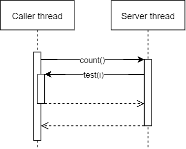

# Request back dispatch

<small>Disclaimer: the example in this article is only for showcasing the back dispatching feature. It is not efficient, and there are more performant ways to achieve the same goal.</small>

There may be many cases when you call a method over the RMI connection, and during the serving of that request, the implementation will issue another call back to the caller. One simple example for this:

```java
public interface Stub {
	public int count(IntPredicate predicate);
}
public class Impl implements Stub {
	private List<Integer> items;

	@Override	
	public int count(IntPredicate predicate) {
		int c = 0;
		for (Integer i : items) {
			if (predicate.test(i)) {
				++c;
			}
		}
		return c;
	}
}
```

In the above example we have a scenario where the `count()` method counts the number of elements that match a given predicate. When the `count()` method is called on an RMI proxy, and the passed `predicate` is an RMI proxy as well, then every `test()` call will cause another request to be made over the connection. In order to ensure proper operation, the RMI runtime needs to dispatch the back-requests to the originating thread. The following sequence diagram showcases how the operation will go down:



You can see that the `test()` method is invoked *on the same thread* that issued the `count()` method call.

This behaviour is **especially** important, as not invoking the back-requests on the same threads could easily cause deadlocks. For example if the caller works as follows:

```java
private final Stub stub;
private int mod;

public synchronized int getCount() {
	return stub.count(i -> {
		synchronized (this) {
			return i % mod == 0;
		}
	});
}
public synchronized void setMod(int mod) {
	this.mod = mod;
}
```

We have a thread-safe client that uses the `stub` remote object to perform some operations. The `getCount()` method is `synchronized`, allowing only a single thread to call it at the same time. It calls the `impl.count()` method, which will initiate an RMI network request, and waits for the result.

If back dispatching didn't exist, the first time the implementation calls `test()`, the system would deadlock. It would deadlock, as the `test()` call would run on a different thread than the one running `getCount()`, therefore couldn't enter the monitor of `this`.

The back dispatching solves this issue, and comes with an another advantage that the same thread resources are available for back-dispatched requests as the initiating caller. (This is important if [`ThreadLocals`](https://docs.oracle.com/javase/8/docs/api/java/lang/ThreadLocal.html) are used.)
